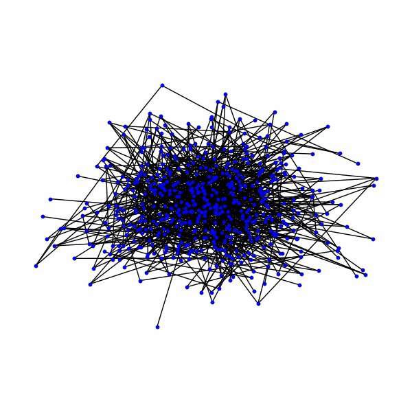

# fracture_network_deepgen
Example of fracture networks deep generation using GraphRNN and DDPM.

<br>

<br/>


This repository is associated with forthcoming paper:

**Fracture network generation using graph deep learning**

Ana Paula Burgoa Tanaka <sup>*</sup>, Philippe Renard, Julien Straubhaar, Xiao Xia Liang 


## Journal reference
Forthcoming

## Data description
Open fracture networks interpretation data from: 

Graph-based fracture network analysis to integrate structural geology properties and identify preferential flow pathways in the aquifer system of Tsanfleuron, Swiss Alps. Journal of Structural Geology. Volume 201.

https://github.com/anapaulabtanaka/tsanfleuron_fracture_networks


https://doi.org/10.5281/zenodo.15739431

### Files
In the "data" folder, you will find:
 
- Links and nodes for the graph generation with GraphRNN and DDPM - Tsanfleuron
  - Filename: `Tsanfleuron_nodes.dat`
  - Filename: `Tsanfleuron_links.dat`
 
- Fracture networks as graphs for the graph generation with GraphRNN and DDPM - Tsanfleuron
  - Filename: `tsan_largest_cc.pickle`
  - Filename: `tsansimple_largest_cc.pickle`
  - Filename: `3dtsan.pickle`
 
- Fracture networks as graphs for the graph generation with GraphRNN and DDPM - Fracture patterns
  - Filename: `braided.pickle`
  - Filename: `brick.pickle`
  - Filename: `diamond.pickle`
  - Filename: `hexagon.pickle`
  - Filename: `pavement.pickle`
  - Filename: `polygonal.pickle`
  - Filename: `star.pickle`
  - Filename: `stochastic.pickle`

## Deep graph generation

For the GraphRNN and DDPM please check: [https://github.com/ERC-Karst/karst_networks_gen](https://github.com/ERC-Karst/karst_networks_gen_public/tree/v1.0.0)


In: Lauzon, D., Straubhaar, J., Renard, P. A deep generative model for the simulation of discrete karst networks. Earth and Space Science, 12. https://doi.org/10.1029/2025EA004360


In: Julien Straubhaar. (2025). ERC-Karst/karst_networks_gen_public: Version 1.0.0, submitted to Earth and Space Science (v1.0.0). Zenodo. https://doi.org/10.5281/zenodo.15090730


## Dependencies
Use the package manager [pip](https://pip.pypa.io/en/stable/) to install the following packages.

```bash
pip install matplotlib, numpy, scipy, networkx, pyvista, karstnet, pytorch, torch_geometric, cuda
```
## Examples

For the graph generation, extrution and slice extraction:

`shape2graph.ipynb` : transform a fracture interpretation in graph, plot and export.

`2D23D_fracture_networks_graphs.ipynb` : extrude the 2D graph to a 3D network and generate 2D and 3D graphs.


You will find the notebooks examples in the folder "gen_Tsanfleuron", "gen_Tsanfleuron_simple" and "gen_Tsanfleuron3d, they are based in the examples from [https://github.com/ERC-Karst/karst_networks_gen](https://github.com/ERC-Karst/karst_networks_gen_public/tree/v1.0.0):


`00_graphData_collection.ipynb` : generate a collection of subgraphs (from the main graph) for data set and test set.

`01_graphRNN_model_train.ipynb` : define and train the GraphRNN model.

`02_graphRNN_model_play.ipynb` (optional step) : play / test the Graph RNN model for graph generation (topology only).

`03_graphDDPM_model_train.ipynb` : define and train the GraphDDPM model for node features generation.

`04_graphDDPM_model_play.ipynb` (optional step) : play / test the Graph DDPM model for node features generation.

`05_gen_graph.ipynb` : generate an ensemble of graphs (topology + node features) : the topology is generated using the Graph RNN model, then the node features are generated using Graph DDPM model.

`06_gen_graph_anim.ipynb` (optional step) : animation of the denoising process.

`07_gen_graph_stats.ipynb` : compute statistics on generated graphs and on the graphs from the data set.
